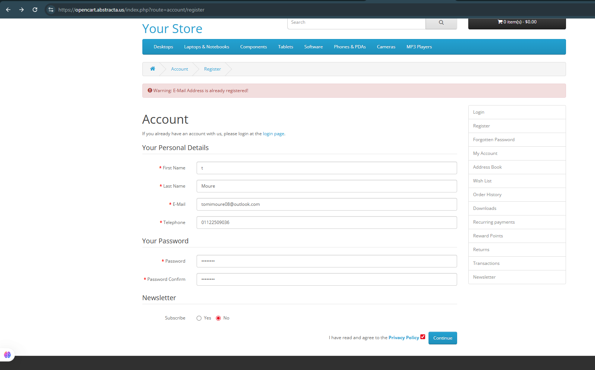

# 🐞 Bug Report – Error de validación de datos al registrarme

- **ID**: BUG-TC-002
- **Título**: Registro con nombre inválido (longitud mínima no respetada)
- **Fecha**: 2025-07-25
- **Criticidad**: Media
- **Tipo de defecto**: Validación de datos
- **Pasos para reproducir**:
  1. Ingresar a la página de registro.
  2. Completar todos los campos con datos válidos, excepto el campo "First Name", en el cual se ingresa solo un carácter (ej: "t").
  3. Aceptar los términos y condiciones.
  4. Hacer clic en el botón "continue".
- **Resultado esperado**: El sistema debería mostrar un mensaje indicando que el campo First Name debe contener al menos un mínimo de caracteres.
- **Resultado real**: El sistema no mostró ninguna corrección sobre el campo First Name. Solo arrojó el mensaje "E-Mail Address is already registered!", lo que indica que se corrigió el campo email pero no el nombre demasiado corto.
- **Evidencia**: 
