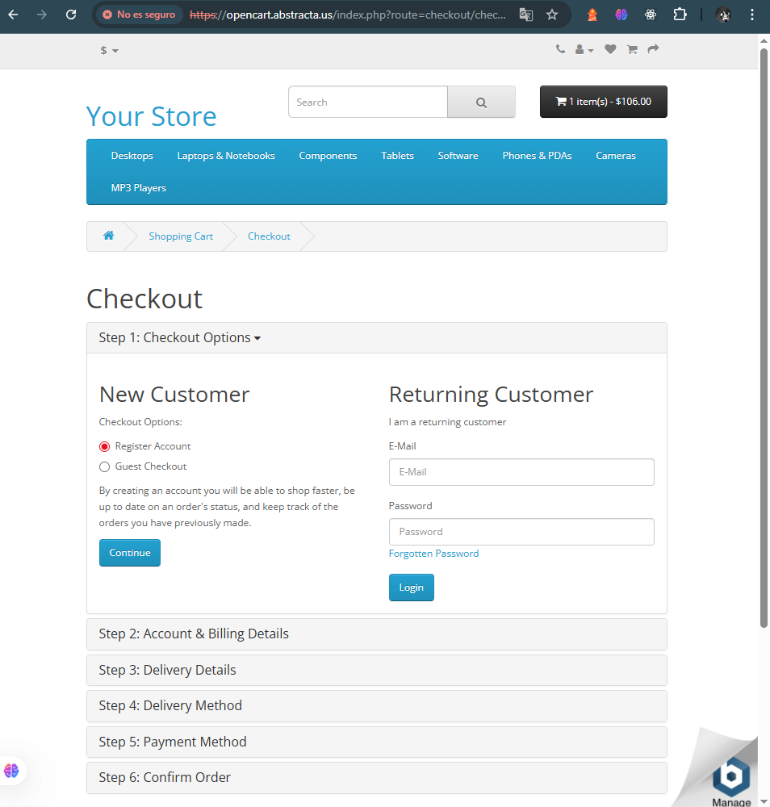

# 🐞 Bug Report – BUG-TC-015

- **ID**: BUG-TC-015
- **Título**: Validación de compra de iphone sin stock
- **Fecha**: 2025-08-15
- **Criticidad**: Alta
- **Tipo de defecto**: De Validación de datos
- **Pasos para reproducir**:
  1. Ingresar a la página de [inicio](https://opencart.abstracta.us/).
 2. Seleccionar el producto iPhone y hacer clic en el carrito de compras.
 3. Ir hacia el carrito de compras clickeando el botón negro de la parte superior derecha en el header.
 4. En "Estimate Shipping & Taxes" rellenar los campos (país, estado/región y código postal) con información válida.
 5. Clickear en checkout.
- **Resultado esperado**: Que el sistema valide que los productos que no están en stock no pueden comprarse (ej: Producto sin stock, no se puede continuar con la compra).
- **Resultado real**: La compra es aceptada y continua el proceso de esta.
- **Evidencia**: 