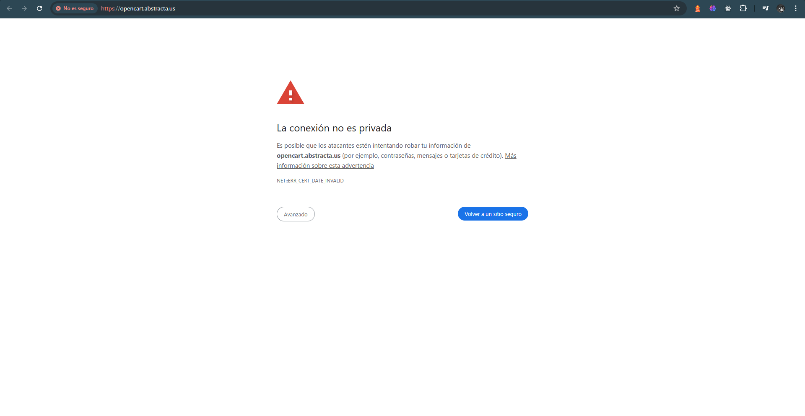

# 🐞 Bug Report – Advertencia de conexión insegura al acceder al sitio

- **ID**: BUG-TC-900
- **Título**: El sitio muestra advertencia de conexión no privada al ingresar.
- **Fecha**: 2025-07-31
- **Criticidad**: Alta
- **Tipo de defecto**: De Seguridad / Certificado SSL
- **Pasos para reproducir**:
  1. Ingresar a la página de [inicio](https://opencart.abstracta.us/).
  2. Observar el mensaje de advertencia del navegador.
- **Resultado esperado**: El sitio debería contar con un certificado SSL válido, por lo que el navegador debería mostrar una conexión segura (https:// con candado verde) sin advertencias al ingresar.
- **Resultado real**: El navegador lanza el siguiente mensaje: “La conexión no es privada. Es posible que los atacantes estén intentando robar tu información de opencart.abstracta.us (por ejemplo, contraseñas, mensajes o tarjetas de crédito).” Esto impide el acceso directo al sitio.
- **Evidencia**: 