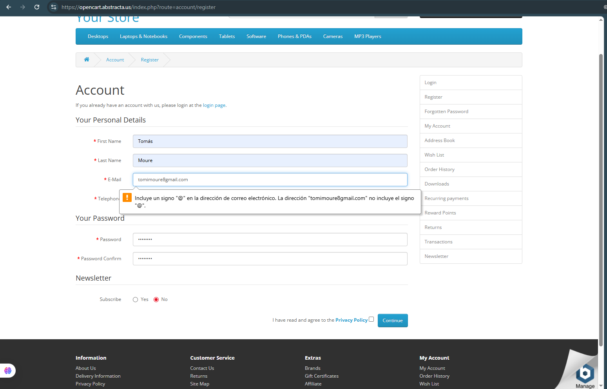

# 🧪 Caso de prueba – register rechazado

- **ID**: TC-003
- **Título**: Registro con email inválido (sin @)
- **Descripción**: No se permite completar el campo "E-mail" sin @.
- **Tipo**: Negativo
- **Precondiciones**: No haber iniciado sesión.
- **Pasos**:
  1. Ingresar a la página de registro.
  2. Completar todos los campos con datos válidos, excepto el campo "E-mail", en el cual se ingresa un email sin el @ (ej: "tomimoure8gmail.com").
  3. Aceptar los términos y condiciones.
  4. Hacer clic en el botón "continue".
- **Resultado esperado**: El sistema debería mostrar un mensaje indicando que al campo "E-mail" le falta el @.
- **Resultado real**: El sistema mostró un mensaje indicando que el campo "E-mail" no incluye el signo "@".
- **Estado**: Pasó
- **Evidencia**: 