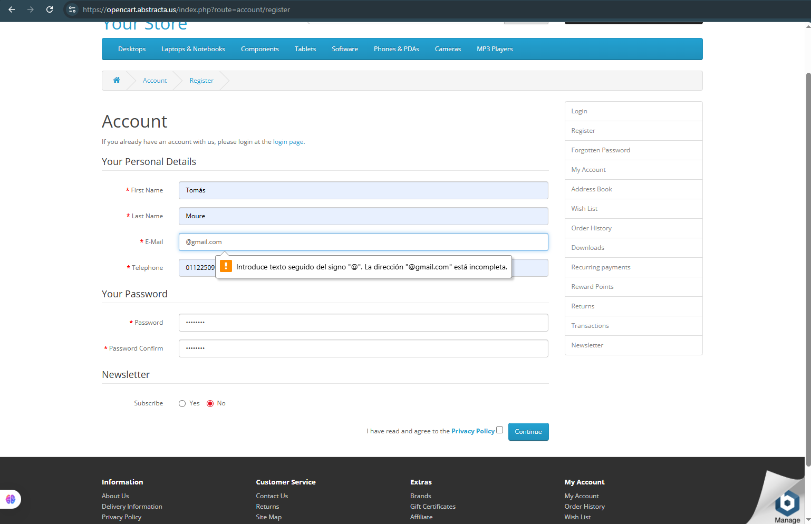

# 🧪 Caso de prueba – register rechazado

- **ID**: TC-004
- **Título**: Registro con email inválido (longitud menor a la exigida)
- **Descripción**: No se permite completar el campo "E-mail" sin más texto.
- **Tipo**: Negativo
- **Precondiciones**: No haber iniciado sesión.
- **Pasos**:
  1. Ingresar a la página de registro.
  2. Completar todos los campos con datos válidos, excepto el campo "E-mail", en el cual se ingresa un email con caracteres <6 o por abajo del minimo permitido (ej: "@gmail.com").
  3. Aceptar los términos y condiciones.
  4. Hacer clic en el botón "continue".
- **Resultado esperado**: El sistema debería mostrar un mensaje indicando que al campo "E-mail" está incompleto.
- **Resultado real**: El sistema mostró un mensaje indicando que el campo "E-mail" está incompleto.
- **Estado**: Pasó
- **Evidencia**: 