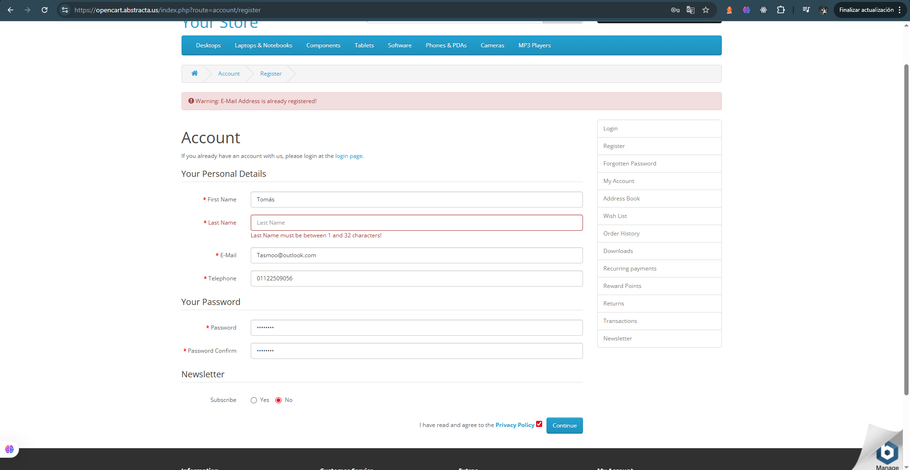

# 🧪 Caso de prueba – TC-007

- **ID**: TC-007
- **Título**: Registro exitoso con 32 caracteres válidos en el campo "Last Name"
- **Descripción**: Se prueba que el sistema permita registrar un usuario cuando el campo "Last Name" contiene el máximo permitido de 32 caracteres alfabéticos válidos. 
- **Tipo**: Positivo
- **Precondiciones**: No haber iniciado sesión.
- **Pasos**:
  1. Ingresar a la página de registro.
  2. Completar todos los campos con datos válidos y completar el campo "Last Name" con exactamente 32 caracteres alfabéticos (ej: "FernandezFernandezFernandezFern").
  3. Aceptar los términos y condiciones.
  4. Hacer clic en el botón "continue".
- **Resultado esperado**: El sistema debería completar el registro exitosamente y redirigir al usuario a la sección “Account”.
- **Resultado real**: El sistema te redirije a la sección "Account" donde indica que el registro fue un éxito.
- **Estado**: Pasó
- **Evidencia**: 