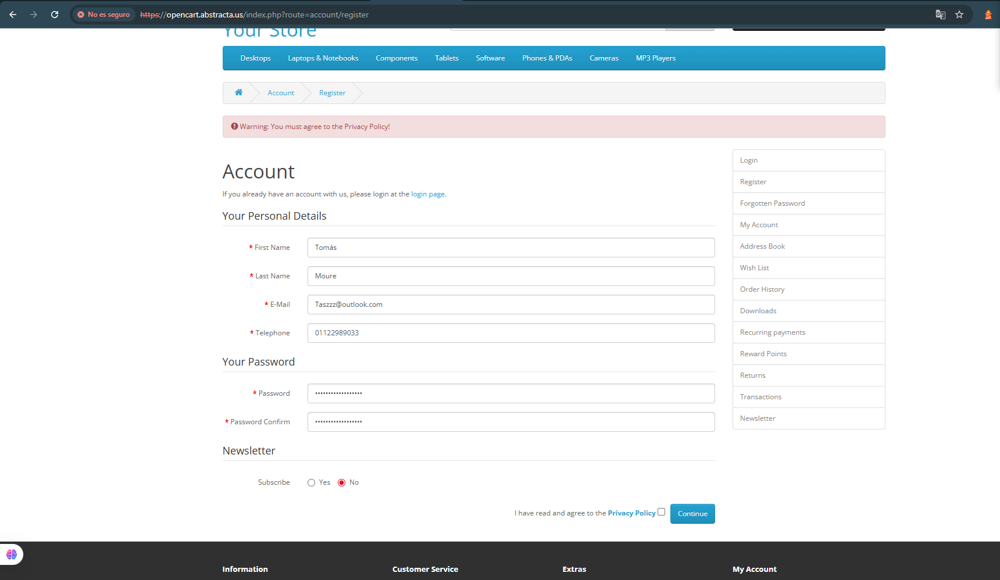

# 🧪 Caso de prueba – TC-013

- **ID**: TC-013
- **Título**: Registro rechazado por no aceptar la política de privacidad con newsletter suscrito.
- **Descripción**: Se valida que el sistema rechace un intento de registro cuando no se acepte la política de privacidad pero si el newsletter.
- **Precondiciones**: No haberse logueado.
- **Tipo**: Negativo
- **Pasos**:
  1. Ingresar a la página de [inicio](https://opencart.abstracta.us/).
  2. Hacer clic en el ícono de usuario del menú de navegación y seleccionar la opción "Register".
  3. Completar todos los campos con datos válidos.
  4. Suscribirse al newsletter.
  5. No aceptar los términos y condiciones.
  6. Hacer clic en el botón "Continue".
- **Resultado esperado**: El sistema debería mostrar un mensaje de validación indicando: "Warning: You must agree to the Privacy Policy!".
- **Resultado real**: El sistema muestra el mensaje de validación indicando: "Warning: You must agree to the Privacy Policy!".
- **Estado**: Pasó
- **Evidencia**: 