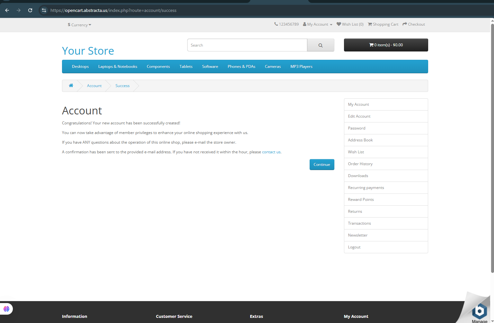

# 🧪 Caso de prueba – TC-014

- **ID**: TC-014
- **Título**: Validación de conexión segura al acceder al sitio
- **Descripción**: Se valida que la conexión al sitio esté protegida por HTTPS con certificado válido.
- **Precondiciones**: Navegador actualizado.
- **Pasos**:
  1. IngreIngresar al sitio desde un navegador (Chrome, Firefox, etc).
  2. Observar si aparece alguna advertencia de seguridad.
- **Resultado esperado**: El sitio debería contar con un certificado SSL válido y el navegador no debería mostrar advertencias.
- **Resultado real**: El navegador muestra advertencia de "Conexión no es privada".
- **Estado**: Falló
- **Evidencia**: 