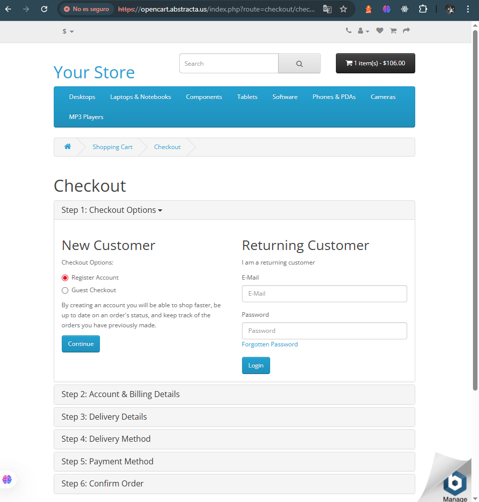

# Caso de prueba TC-015

- **ID**: TC-015
- **Título**: Validación de compra de iphone sin stock
- **Descripción**: Se prueba la validación de una compra de un producto sin stock 
- **Tipo**: Negativo
- **Precondición**: El producto iPhone debe figurar como sin stock en el sistema antes de iniciar la prueba.
- **Pasos**:
 1. Ingresar a la página de [inicio](https://opencart.abstracta.us/)
 2. Seleccionar el producto iPhone y hacer clic en el carrito de compras.
 3. Ir hacia el carrito de compras clickeando el botón negro de la parte superior derecha en el header.
 4. En "Estimate Shipping & Taxes" rellenar los campos (país, estado/región y código postal) con información válida.
 5. Clickear en checkout.
- **Resultado esperado**: Que el sistema valide que los productos que no están en stock no pueden comprarse (ej: Producto sin stock, no se puede continuar con la compra).
- **Resultado real**: La compra es aceptada y continua el proceso de esta.
- **Estado**: Falló.
- **Evidencia**:    
